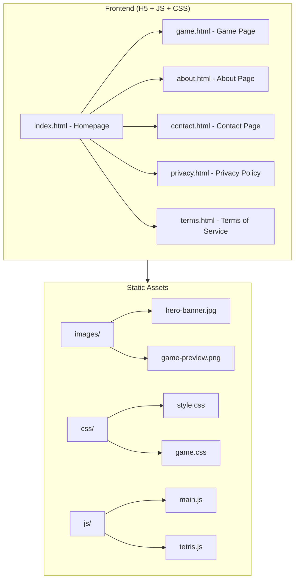

# Tetris Online - Project Design Document

## 1. System Architecture



## 2. Page Structure

### 2.1 Homepage (index.html)
- Hero section with attractive cover image
- Game introduction section
- Features highlights
- Call-to-action buttons
- Footer with navigation links

### 2.2 Game Page (game.html)
- Mobile-optimized game canvas
- Touch-friendly controls
- Score display
- Next piece preview
- Pause/Resume functionality

### 2.3 Legal Pages
- About: Website introduction
- Contact: Email display only
- Privacy Policy: GDPR/CCPA/COPPA compliant
- Terms of Service: Standard terms

## 3. UI/UX Specifications

### 3.1 Color Palette
```
Primary: #FF6B9D (Playful Pink)
Secondary: #4ECDC4 (Mint Green)
Accent: #FFE66D (Sunny Yellow)
Background: #FFF5F7 (Soft Pink)
Text Primary: #2D3436 (Dark Gray)
Text Secondary: #636E72 (Medium Gray)
Card Background: #FFFFFF
Shadow: rgba(255, 107, 157, 0.15)
```

### 3.2 Typography
```
Font Family: 'Nunito', 'Comic Neue', sans-serif
Heading: 700 weight
Body: 400 weight
Button: 600 weight
```

### 3.3 Spacing System
```
xs: 4px
sm: 8px
md: 16px
lg: 24px
xl: 32px
xxl: 48px
```

### 3.4 Border Radius
```
Small: 8px
Medium: 12px
Large: 16px
Full: 50%
```

## 4. Mobile-First Design Principles

1. Touch targets minimum 44x44px
2. Swipe gestures for game controls
3. Bottom navigation for easy thumb access
4. Responsive breakpoints: 320px, 480px, 768px, 1024px
5. Game controls positioned at bottom for comfortable play

## 5. Game Controls (Mobile Optimized)

- Swipe Left/Right: Move piece
- Swipe Down: Soft drop
- Tap: Rotate piece
- Long Press: Hard drop
- On-screen buttons as alternative

## 6. Third-Party Services

1. **Cloudflare**: CDN and security
2. **Plausible Analytics**: Privacy-friendly analytics
3. **Google Fonts**: Typography (Nunito)
